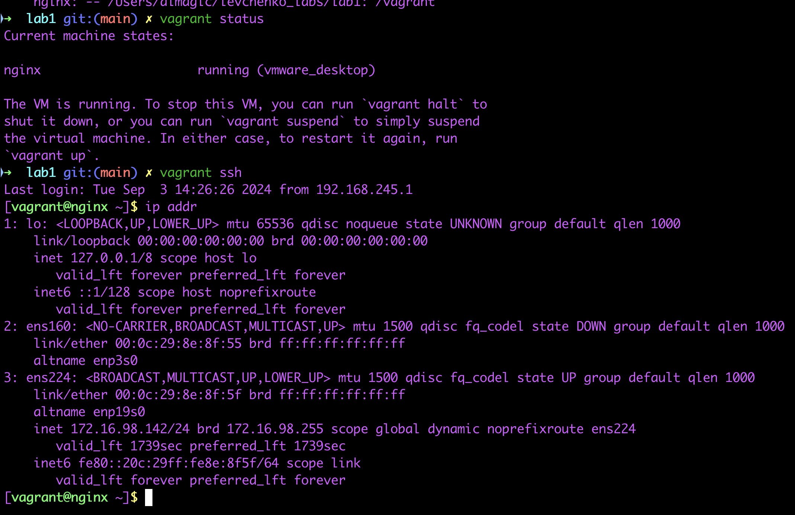

# Лабораторная 1
## Задача
Попрактиковаться в написании плейбука, со следующими условиями:
- подготовить стенд на Vagrant,
- настроить ansible для доступа к стенду
- написать плейбук, который устанавливает NGINX в конфигурации по умолчанию, с
применением модуля yum
- подготовить шаблон jinga2 новой конфигурации для nginx, чтобы сервис слушал на
нестандартном порту 8080. В шаблоне для номера порта использовать переменные ansible
- добавить в плейбук копирование новой конфигурации сервиса на стенд
- должен быть использован механизм notify для рестарта nginx после установки или
изменения конфигурации

## Ход работы
Работа выполнялась на MacOS с использованием Vagrant версии 2.4.1, VMware Fusion и vagrant плагина для работы с VMware вместо VirtualBox

Почему VMware? - VirtualBox у меня нестабильно работал, вылетал и позже был удален

Вследствие есть ограничение по сравнению с VirtualBox - невозможность задать статические IP адреса виртуальным машинам. Но я нашел выход с использованием dhcp (см. [Vagrantfile](Vagrantfile))

Демонстрация работы:
