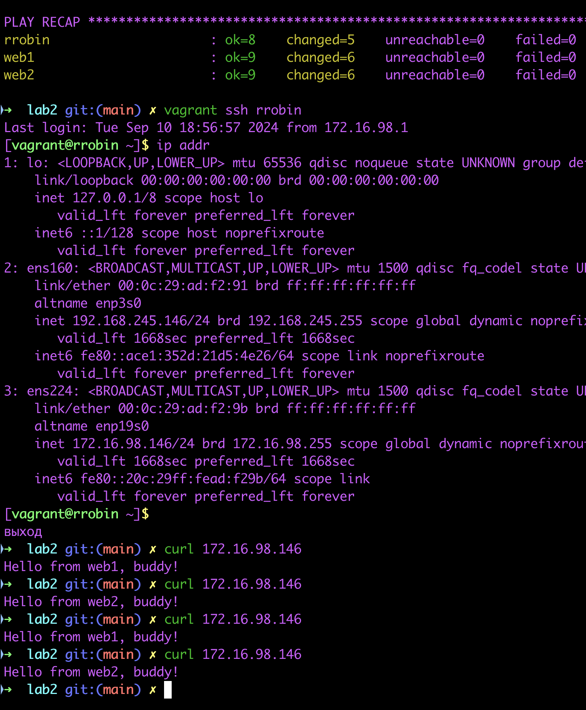

# Лабораторная 2
## Задача
1. На серверах rrobin, web1, web2 установить nginx.
2. На серверах web1, web2 Nginx должен работать по порту 8080 и отдавать кастомную страницу, зайдя на которую можно понять на каком сервере вы находитесь.
3. На сервере rrobin Nginx должен обеспечить балансировку нагрузки серверов web1 и web2 в режиме round-robin. Вес каждого сервера одинаковый.
4. Установка и настройка всего ПО должна быть обеспечена Ansible-сценарием.
5. Все файлы по этому заданию выложить в Github и написать ReadMe со скринами работоспособности и инструкцией по запуску вашего Ansible-сценария
P.S. Использовать по максимуму переменные. Переменные должны называться ЛОГИЧНО Все конфиги на серверах должны генерироваться через templates

## Ход работы
Работа выполнялась на MacOS с использованием Vagrant версии 2.4.1, VMware Fusion и vagrant плагина для работы с VMware вместо VirtualBox

Почему VMware? - VirtualBox у меня нестабильно работал, вылетал и позже был удален

Вследствие есть ограничение по сравнению с VirtualBox - невозможность задать статические IP адреса виртуальным машинам. Но я нашел выход с использованием dhcp (см. [Vagrantfile](Vagrantfile))

Демонстрация работы:
