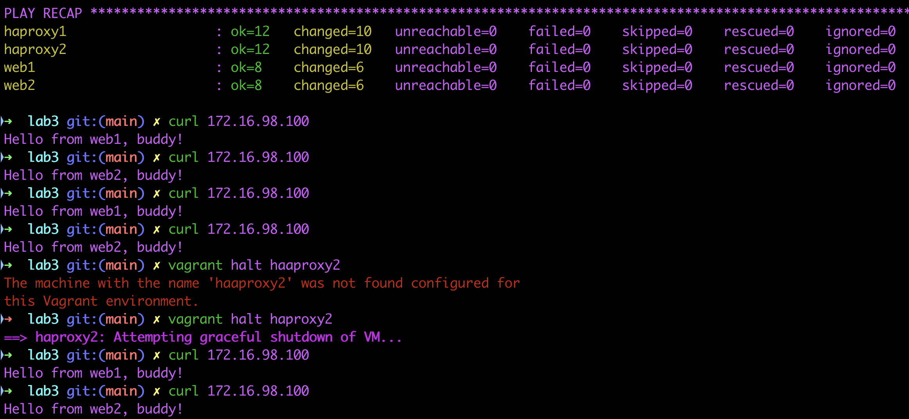
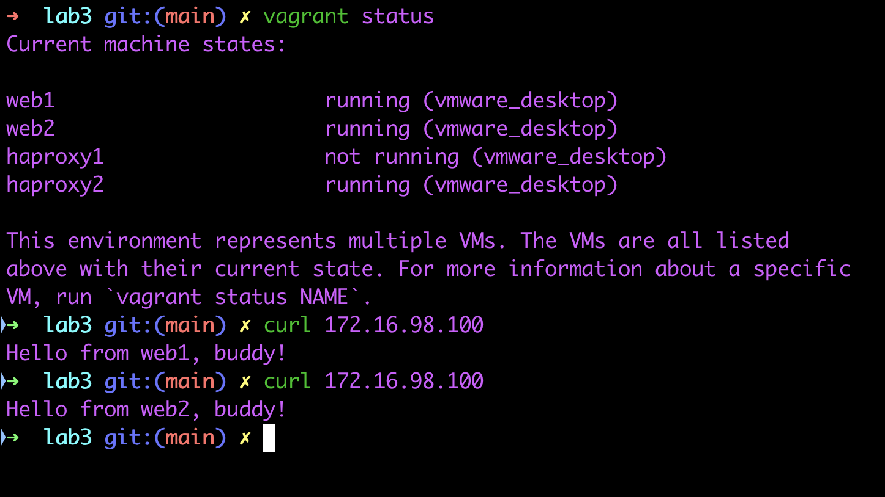

# Лабораторная 2
## Задача
1. На серверах web1, web2 установить Nginx.
2. На серверах haproxy1, haproxy2 установить и настроить  отказоустойчивую связку HAProxy+Keepalived. Настроить VIP с помощью Keepalived в соответствии со схемой
3. На серверах web1, web2 Nginx должен работать по порту 8080 и отдавать кастомную страницу, зайдя на которую можно понять на каком сервере вы находитесь.
4. На серверах с HAProxy ПО должно обеспечить балансировку нагрузки серверов web1 и web2 в режиме round-robin. Сделать таймауты ожидания ответа web1 и web2 как можно меньше. Скажем, 1-2 секунды
5. Установка и настройка всего ПО должна быть обеспечена Ansible-сценарием.
6. Все файлы по этому заданию выложить в Github и написать ReadMe со скринами работоспособности и инструкцию по запуску вашего Ansible-сценария.

## Ход работы
Работа выполнялась на MacOS с использованием Vagrant версии 2.4.1, VMware Fusion и vagrant плагина для работы с VMware вместо VirtualBox

Почему VMware? - VirtualBox у меня нестабильно работал, вылетал и позже был удален

Вследствие есть ограничение по сравнению с VirtualBox - невозможность задать статические IP адреса виртуальным машинам. Но я нашел выход с использованием dhcp (см. [Vagrantfile](Vagrantfile))

Демонстрация работы:

    Virtual IP - 172.16.98.100

