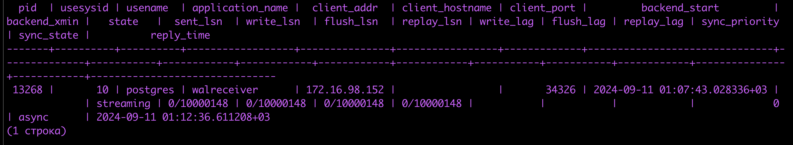
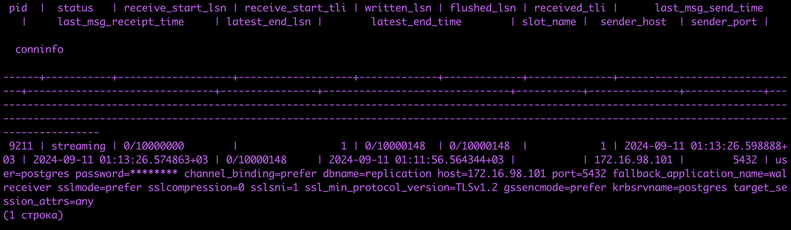
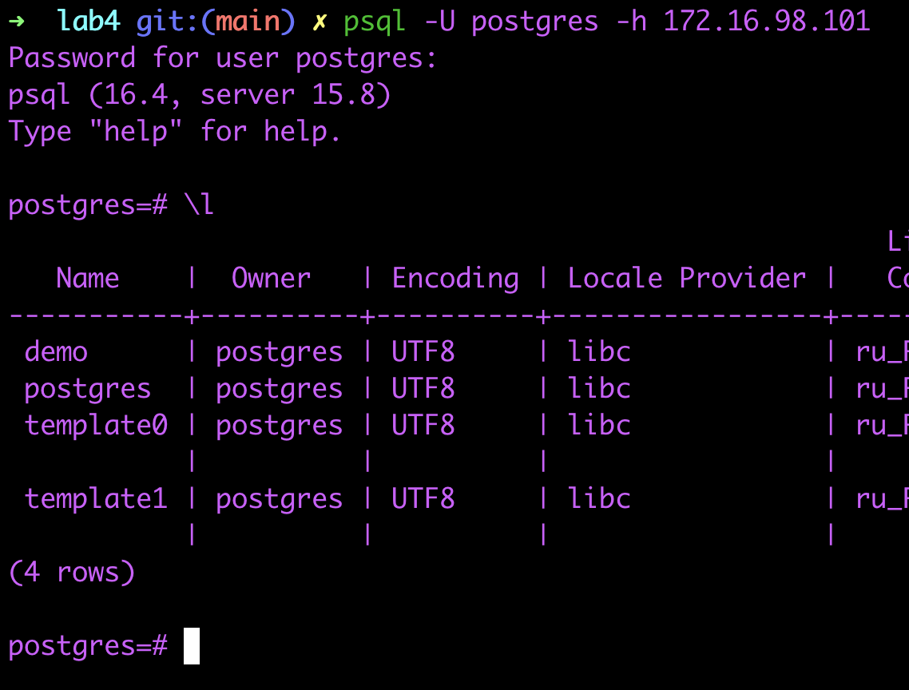
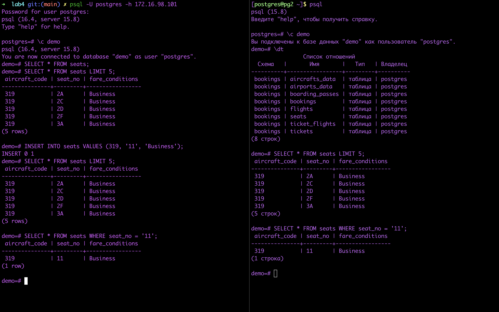

# Лабораторная 4
## Задача
1. На сервера pg1 и pg2 установить PostgreSQL 15. Залить small БД с https://postgrespro.ru/education/demodb на pg1. Между серверами настроить репликацию данных.
2. *Настроить Keepalived таким образом, чтобы при обращении на VIP можно было попасть на мастер ноду.

'*' - половина зачёта. Вторая половина - все сданные лабы. Кто первый сделает это задание, тот получает зачёт


## Ход работы
Работа выполнялась на MacOS с использованием Vagrant версии 2.4.1, VMware Fusion и vagrant плагина для работы с VMware вместо VirtualBox

Почему VMware? - VirtualBox у меня нестабильно работал, вылетал и позже был удален

Вследствие есть ограничение по сравнению с VirtualBox - невозможность задать статические IP адреса виртуальным машинам. Но я нашел выход с использованием dhcp (см. [Vagrantfile](Vagrantfile))

#### Шаги

1. Поднять 2 сервера pg1 и pg2
2. Запустить ```ansible-playbook main.yml``` (отключит SELinux, установит и сконфигурирует keepalived так, чтобы master-ом был назначен pg1, установит postgresql-15)
2. `ansible all -m shell -a 'postgresql-15-setup initdb' -b`
2. `ansible all -m service -a "name=postgresql-15 state=started enabled=true" -b`

    **На master хосте (pg1):**
4. ```sudo su - postgres```
5. ```psql -c "ALTER ROLE postgres PASSWORD '1234'"```
6. В конец файла `/var/lib/pgsql/15/data/pg_hba.conf` добавить
```
host    replication    postgres    <replica_ip_address>/32    md5
host    all            postgres    <gateway_ip_address>/32    md5
```
Адрес шлюза для доступа через keepalived 

8. В файле `/var/lib/pgsql/15/data/postgres.conf` изменить следующие параметры:
    
    * listen_addresses = 'localhost, MASTER_ВНУТРЕННИЙ_IP, АДРЕС_ШЛЮЗА'
    * max_wal_senders = 10 # Макс. число реплик
8. Установить демо БД:

    * `wget https://edu.postgrespro.ru/demo-small.zip`
    * `zcat demo-small.zip | psql`
9. Перезапустить postgresql: `systemctl restart postgresql-15.service`

    **На replica хосте (pg2)**
10. Шаги 5-8s, но с измененными IP адресами
11. В `/var/lib/pgsql/15/recovery.conf` добавить

```
standby_mode = 'on'
primary_conninfo = 'host=172.16.98.101 port=5432 user=postgres'
```
12. Очистить директорию: `rm -rf /var/lib/pgsql/15/data/*`
13. Восстановить из бэкапа: `pg_basebackup -R -h 172.16.98.101 -U postgres -D /var/lib/pgsql/15/data -P`
(Я в ansible роли проставил VIP = 172.16.98.101)

12. Перезапустить postgresql: `systemctl restart postgresql-15.service`

Демонстрация работы:
На мастере статус

На реплике статус

Доступ с локалхоста

Репликация
