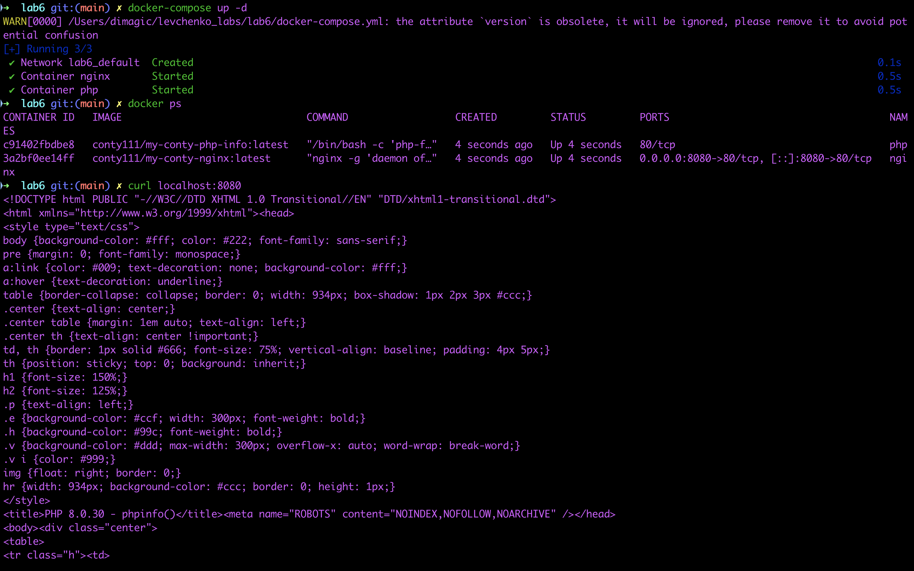

# Лабораторная 6
## Задача
1. Создать кастомные образы nginx и php на базе alpine (php должен отдавать php-info)
2. Запушить образы в Docker Hub
3. Сделать docker compose, в котором запрос с nginx идет на php и отдает php-info

'*' - половина зачёта. Вторая половина - все сданные лабы. Кто первый сделает это задание, тот получает зачёт

## Результат

* conty111/my-conty-nginx:latest - образ с nginx-ом
* conty111/my-conty-php-info:latest - образ с php info

